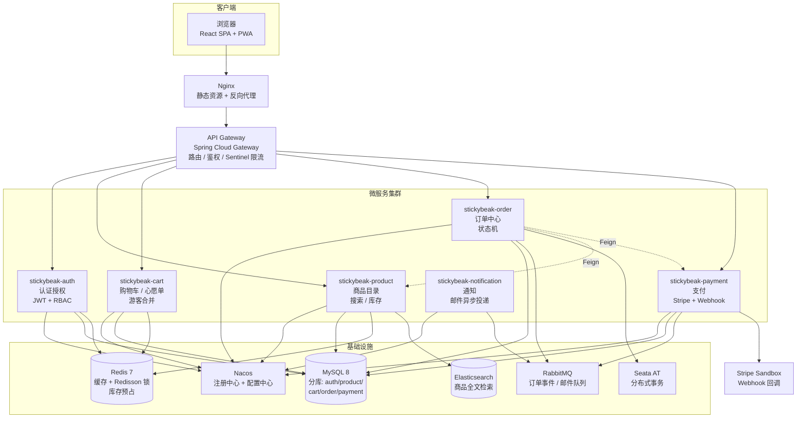

# StickyBeak — 架构设计

> **命名**：StickyBeak 是地道澳俚"爱凑热闹的人"，同时暗合 sticky（磁贴）+ beak（鸟喙，对应招牌大葵/蒜苗鸡小鸟系列）。
> 数据源：小红书 GDCUP 的澳洲冰箱贴商品内容（已获授权）。
> 定位：作品集项目优先，架构预留真实上线余地。
> 后端：Java 17 + Spring Cloud 微服务（对标 whale-logistics-cms）
> 前端：React 18 SPA（对标 Novacart 的电商交互 + whale 的工程化）
> 业务蓝本：Novacart / UNSW P14 电商需求规格

---

## 1. 总体架构



## 2. 服务划分

| 服务 | 职责 | 数据库 | 关键中间件 |
|---|---|---|---|
| `stickybeak-gateway` | 统一入口、JWT 校验转发、Sentinel 限流、CORS | — | Sentinel |
| `stickybeak-auth` | 注册/登录/刷新 token、三角色 RBAC、地址管理 | `gdcup_auth` | Redis（token 黑名单） |
| `stickybeak-product` | 商品 CRUD、分类/标签、图片、库存、ES 搜索 | `gdcup_product` | Redis 缓存、ES、Redisson 锁 |
| `stickybeak-cart` | 游客/登录购物车、登录合并、心愿单 | `gdcup_cart` | Redis（购物车快照） |
| `stickybeak-order` | 下单、订单状态机、订单历史、Seata 编排 | `gdcup_order` | RabbitMQ、Seata、Feign |
| `stickybeak-payment` | 支付提供商抽象、Stripe Session、Webhook 幂等 | `gdcup_payment` | RabbitMQ |
| `stickybeak-notification` | 订单确认/状态变更邮件，MQ 消费异步投递 | — | RabbitMQ、邮件 SMTP |
| `stickybeak-admin`（可并入 order/product） | 管理后台聚合 API、销售分析 | 只读跨库 | Redis（分析结果缓存 5min） |
| `stickybeak-common` | 共享模块：`Result<T>`、`ResultCode`、`BusinessException`、`GlobalExceptionHandler`、DTO/VO 基类 | — | — |

> 每个服务内部统一四层：`controller → service(接口+impl) → mapper(MyBatis Plus) → entity`，DTO 入参 / VO 出参，与 whale 完全一致。

## 3. 技术栈总表

### 后端

| 技术 | 版本 | 用途 |
|---|---|---|
| Java | 17 | 主语言 |
| Spring Boot | 3.x | 微服务基座 |
| Spring Cloud | 2022.x | 微服务工具集 |
| Spring Cloud Gateway | — | API 网关 |
| Nacos | 2.x | 注册中心 + 配置中心（多环境配置、动态刷新） |
| Sentinel | 1.8.x | 限流熔断（大促保护下单链路） |
| OpenFeign | — | 服务间调用（下单查库存、创建支付单） |
| MyBatis Plus | 3.5.x | ORM（CRUD、分页、代码生成） |
| MySQL | 8.0 | 主存储（按服务分库） |
| Redis | 7 | 缓存 + Redisson 分布式锁 + token 黑名单 |
| RabbitMQ | 3.x | 订单事件、邮件异步任务 |
| Elasticsearch | 8.x | 商品全文检索 + 多条件筛选 |
| Seata | 1.7.x AT | 下单跨库分布式事务（订单库 + 库存库） |
| Spring Security + JWT | — | 认证授权，access 15min + refresh 7d |
| Knife4j | — | Swagger 增强版 API 文档 |
| JUnit 5 + Mockito | — | 单元/集成测试 |

### 前端

| 技术 | 用途 |
|---|---|
| React 18 + TypeScript | 框架 |
| Vite 5 | 构建 |
| Redux Toolkit | 全局状态：登录态、购物车、心愿单。**为什么不用 Context**：购物车高频更新 + 跨页面共享，Redux 单一 store、可预测状态流、DevTools 时间旅行、中间件生态（RTK Query） |
| React Router v6 | 嵌套路由 + 路由守卫（/profile、/admin） |
| Tailwind CSS |  storefront（面向顾客，设计感优先） |
| Ant Design 5 | admin 后台（表格/表单效率优先） |
| Axios | 统一拦截器：token 注入、401 自动刷新、错误归一化 |
| ECharts | 管理后台销售分析图表 |
| Vitest + RTL | 组件测试 |
| PWA | manifest + Service Worker（Sprint 7） |

### 运维

| 技术 | 用途 |
|---|---|
| Docker + Docker Compose | 全栈一键编排（infra + 8 服务 + 前端） |
| Nginx | SPA 静态托管 + 反代 |
| GitHub Actions | CI：Maven 构建测试、前端 typecheck+Vitest、Docker 镜像构建验证 |
| 阿里云/AWS | 生产预留：ECS/EC2 + RDS MySQL + 云 Redis + S3/OSS 图片 |

## 4. 关键设计决策

### 4.1 认证与角色（P14 三角色）
- 角色：`customer` / `admin` / `sysadmin`，多对多（`t_user_role`）
- JWT HS256：access token 15 分钟，refresh token 7 天（DB 持久化 + 轮换 + 复用检测）
- 前端 token 存 **HttpOnly Cookie**（防 XSS），网关统一校验，服务内用 `@PreAuthorize("hasRole('ADMIN')")` 兜底
- 密码 bcrypt 加盐

### 4.2 防超卖（面试故事线核心）
三层防线，对标 Spring Cloud 大厂方案：
1. **Redis 预扣**：下单先 `DECR`  Redis 库存，不足直接拒绝
2. **Redisson 分布式锁 + 库存预占**：`t_stock_hold` 记录 + TTL  worker 释放超时未支付的预占
3. **DB 最后防线**：`UPDATE t_product SET stock = stock - #{qty} WHERE id = #{id} AND stock >= #{qty}`，影响行数为 0 则失败回滚（Seata AT 兜底跨库一致性）

### 4.3 订单状态机（照搬 Novacart，不落硬编码）
- `t_order_status_transition(from_status, to_status, required_role)` 配置化流转
- `pending → paid → processing → shipped → completed → cancelled`
- `t_order_status_history` 记录每次流转的操作者与时间戳，非法流转返回 422

### 4.4 支付与幂等
- `PaymentProvider` 策略接口（Stripe 实现先行——Stripe 原生支持**澳洲银行卡**、**Alipay 支付宝**、**WeChat Pay 微信**，真实上线只换配置）
- Webhook 三件事：验签 → `t_payment_webhook` 幂等键去重 → 发 MQ 通知订单服务
- 本地开发用 ngrok 暴露 webhook；不存任何卡号（tokenization）

### 4.4.1 多币种 AUD / CNY 切换
- **定价基准币种 AUD**（澳洲本地生意），`t_product.price` 只存 AUD
- `t_exchange_rate` 表存 AUD↔CNY 汇率，定时任务每日刷新（开放汇率 API），Redis 缓存当前汇率
- 前端顶部币种切换器（`currencySlice`），CNY 为**展示换算**；结账时按 Stripe presentment currency 以所选币种真实收款
- 所有金额展示走统一 `formatPrice(cents, currency)` 工具，禁止组件内散落换算
- 订单快照同时记录 `currency` 与 `exchange_rate_at_pay`，历史订单金额不随汇率波动

### 4.5 异步与最终一致
- 订单支付成功 → RabbitMQ `order.paid` 事件 → notification 服务消费发确认邮件（MailHog 本地 / 生产 SMTP）
- 订单状态变更 → MQ → 邮件通知，主流程不阻塞
- ES 索引同步：商品变更 → MQ → product 服务消费刷 ES（不做双写）

### 4.6 搜索
- 顾客按系列（大学/超市/路牌/小鸟）、价格、关键词筛选
- ES 全文检索 + 条件过滤；热搜词与热门标签缓存 Redis
- MySQL 兜底（ES 不可用时降级，Sentinel 熔断触发）

### 4.7 真实商品数据导入（差异化亮点）
- 已爬取 265 篇商品笔记（80 篇含完整正文 + 图集），位于 `classified/商品/`
- Sprint 2 写一次性导入脚本：`info.json` → `t_product` / `t_product_image` / 标签
- 比手造种子数据真实，演示效果强

### 4.8 真实上线预留
- 支付策略接口、地址/物流模块独立表、邮件模板化、对象存储抽象（本地 MinIO ↔ 生产 S3/OSS）
- 国际化预留：商品标题/描述字段设计考虑多语言扩展（`metadata JSON` 兜底）

## 5. 仓库结构（monorepo）

```
stickybeak/
├── stickybeak-gateway/
├── stickybeak-auth/
├── stickybeak-product/
├── stickybeak-cart/
├── stickybeak-order/
├── stickybeak-payment/
├── stickybeak-notification/
├── stickybeak-common/              # Result / 异常 / 常量 / 工具
├── stickybeak-frontend/            # React SPA（storefront + /admin）
├── docker/
│   ├── docker-compose-infra.yml   # MySQL/Redis/MQ/ES/Nacos/Seata/MinIO/MailHog
│   └── docker-compose.yml         # 全栈
├── scripts/
│   └── import-products.py     # classified/商品 → SQL/REST 导入
├── docs/                      # 本文档 / ER / Sprint / API
└── .github/workflows/ci.yml
```

## 6. 开发规范（沿用 whale）

- 代码风格：Alibaba Java Coding Guidelines
- 分支：Git Flow（`main` / `develop` / `feature-xxx` / `hotfix-xxx`）
- Commit：`feat:` `fix:` `docs:` `refactor:` `chore:`
- API：RESTful + 统一 `{ code, message, data }`
- DB：`t_` 表前缀、snake_case、`is_deleted` 逻辑删除、`BIGINT` 主键、`DECIMAL` 金额、`idx_表_列` 索引命名

## 7. 与参考项目的对应关系

| 能力 | Novacart (.NET) | 本项目 (Java) |
|---|---|---|
| 网关 + 限流 | YARP fixed-window | Spring Cloud Gateway + Sentinel |
| 下单编排 | MassTransit Saga + Outbox | Seata AT + RabbitMQ |
| 库存锁 | RedisDistributedLockService | Redisson + 预占 + 条件 UPDATE |
| 搜索 | Elasticsearch (PE-3) | Elasticsearch（同等） |
| 异步邮件 | Channel + BackgroundService | RabbitMQ + notification 服务 |
| 注册配置中心 | .NET Aspire | Nacos |
| 前端状态 | React Context | Redux Toolkit（升级点，可讲为什么） |
