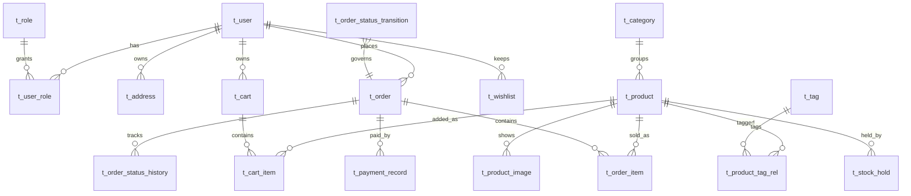

# StickyBeak — 数据库设计（ER）

> 规范：阿里巴巴开发规约。`t_` 前缀、snake_case、`BIGINT` 主键、`DECIMAL(10,2)` 金额、
> `is_deleted` 逻辑删除、`create_time`/`update_time` 必备、索引 `idx_表_列`。
> 分库：按服务边界拆 5 个逻辑库，为 Seata AT 分布式事务铺路。

## 1. stickybeak_auth 库

### t_user
| 列 | 类型 | 说明 |
|---|---|---|
| id | BIGINT PK | 雪花 ID |
| email | VARCHAR(64) UK | 登录邮箱 |
| password_hash | VARCHAR(128) | bcrypt |
| nickname | VARCHAR(32) | |
| phone | VARCHAR(20) | |
| avatar_url | VARCHAR(255) | |
| status | TINYINT | 0 正常 1 禁用 |
| is_deleted / create_time / update_time | — | 规约字段 |

### t_role / t_user_role
- `t_role(id, code, name)`：种子数据 `customer` / `admin` / `sysadmin`
- `t_user_role(id, user_id, role_id)`，UK(user_id, role_id)

### t_refresh_token
| 列 | 说明 |
|---|---|
| id / user_id | |
| token_hash | 只存哈希，防库泄 |
| expires_at | 7 天 |
| revoked | 轮换/登出置位，复用检测 |

### t_address
`id, user_id, receiver, phone, country, state, city, postcode, detail, is_default`
> 独立成表（一人多地址），真实物流预留。

## 2. stickybeak_product 库

### t_category
`id, name, slug, parent_id, sort_order`
> 种子：大学公交路牌 / 超市系列 / 火车电车 / 小鸟路牌 / 酒鬼系列 / 手机壳周边

### t_product
| 列 | 类型 | 说明 |
|---|---|---|
| id | BIGINT PK | |
| name | VARCHAR(128) | 商品名（取自笔记标题提炼） |
| slug | VARCHAR(160) UK | SEO URL |
| description | TEXT | 正文（取自笔记 desc） |
| category_id | BIGINT | idx_product_category |
| price | DECIMAL(10,2) | |
| stock | INT | 防超卖：条件 UPDATE 最后防线 |
| sales | INT | 销量（分析用） |
| source_note_id | VARCHAR(32) | 溯源：小红书笔记 ID |
| metadata | JSON | 系列/尺寸/材质等扩展属性 |
| status | TINYINT | 0 上架 1 下架 |
| is_deleted / create_time / update_time | | |

索引：`idx_product_category_status(category_id, status)`、`idx_product_sales(sales)`

### t_product_image
`id, product_id, url, sort_order, is_cover` — idx_image_product(product_id)
> 开发期用本地 MinIO / 静态目录，生产 S3/OSS。

### t_tag / t_product_tag_rel
- `t_tag(id, name)`：UNSW、USYD、扣死、窝窝屎、T9、电车、大葵……
- `t_product_tag_rel(id, product_id, tag_id)`，UK 防重

### t_stock_hold（库存预占）
| 列 | 说明 |
|---|---|
| id / product_id / order_no / qty | |
| status | 0 占用中 1 已扣减 2 已释放 |
| expire_at | TTL（默认 15min），超时 worker 释放 |

## 3. stickybeak_cart 库

### t_cart
`id, user_id NULL, session_id NULL` — 游客/登录二选一（CHECK 约束），登录后合并

### t_cart_item
`id, cart_id, product_id, qty, price_at_add DECIMAL(10,2)` — 加购时价格快照

### t_wishlist
`id, user_id, product_id, create_time`，UK(user_id, product_id)

## 4. stickybeak_order 库

### t_order
| 列 | 说明 |
|---|---|
| id / order_no UK | 业务单号（日期+雪花） |
| user_id / address_snapshot JSON | 下单时地址快照 |
| total_amount / currency / exchange_rate_at_pay | 金额 + 币种 + 支付时汇率快照 |
| status | |
| pay_time / ship_time / complete_time | |
| remark | |

### t_order_item
`id, order_id, product_id, product_name, product_image, price DECIMAL(10,2), qty`
> 名称/图/价格全快照，商品后续改价不影响历史订单（P14 硬性要求）。

### t_order_status_transition（状态机配置表）
| from_status | to_status | required_role |
|---|---|---|
| pending | paid | system |
| paid | processing | admin |
| processing | shipped | admin |
| shipped | completed | system/customer |
| * | cancelled | admin/system |

### t_order_status_history
`id, order_id, from_status, to_status, operator_id, operator_role, create_time`

## 5. stickybeak_payment 库

### t_payment_record
`id, order_no, provider(stripe), payment_method(card/alipay/wechat_pay), session_id, amount, currency(aud/cny), exchange_rate_at_pay, status, transaction_id, pay_time`

### t_exchange_rate
| 列 | 说明 |
|---|---|
| id / base_currency / quote_currency | AUD→CNY 等 |
| rate DECIMAL(12,6) | |
| fetched_at | 定时任务每日刷新，Redis 缓存当前值 |

### t_payment_webhook（幂等表）
| 列 | 说明 |
|---|---|
| id / event_id UK | Stripe event id，重复投递直接 no-op |
| event_type / payload JSON | |
| processed | 0 未处理 1 已处理（失败留档人工重试） |

## 6. 跨库一致性（Seata AT 场景）

下单链路跨 3 库：
1. `stickybeak_order.t_order` 插入（pending）
2. `stickybeak_product.t_product` 条件扣减 + `t_stock_hold` 核销
3. `stickybeak_cart.t_cart_item` 清理已购项

任一失败 → Seata AT 全局回滚。支付回调只发 MQ，由 order 服务消费推进状态机，最终一致。

## 7. ES 索引（非 MySQL）

`products` 索引：`name(text, ik 分词), description(text), category_id, tag_ids, price, sales, status`
> 商品变更 → RabbitMQ → product 服务消费同步 ES；ES 挂了 Sentinel 降级走 MySQL LIKE。

## 8. 数据导入映射（classified/商品 → 表）

| 来源（info.json） | 目标 |
|---|---|
| title 提炼 | t_product.name |
| desc | t_product.description |
| 封面 + 图集文件 | t_product_image（复制到 MinIO/静态目录） |
| id | t_product.source_note_id |
| 标题关键词（UNSW/扣死/T9/大葵…） | t_tag + 关联 |
| index | 排序参考 |
| 手工补录 | price / stock / category_id |
